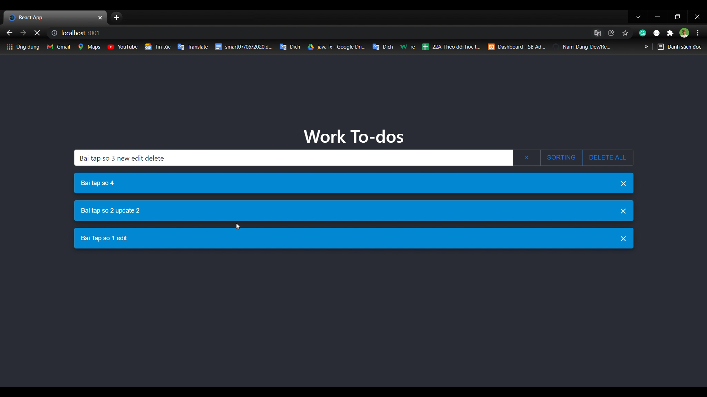

# Todo-app

## Note: Can not connect to datbase server with your ip when you run project in local
- Because I config trusted_server_ip in my mongod database to my ip; So only me can connect
- If you want to demo please cho Live demo 

## Live demo 
- http://103.27.237.13/
## Video demo


## Screenshots



## Download
### download all
```
    git clone https://github.com/longnguyen-2k/todo-app.git

```
### FE as zip
```
   https://github.com/longnguyen-2k/todo-app/raw/main/Todo-FE.zip

```
### BE as zip
```
   https://github.com/longnguyen-2k/todo-app/raw/main/Todo-BE.zip

```
## Requirements

- [Node](https://nodejs.org/en/) &gt;=v16.x.x / [npm](https://www.npmjs.com/) &gt;=8.x.x
  - Recommend installing with [nvm](https://github.com/creationix/nvm)
- [Yarn](https://classic.yarnpkg.com) &gt;=1.22.4
## Step I did

### Step 1:
- Install NodeJs on CentOS 8
### Step 2:
Install MongoDB on CentoOS 8
### Step 3:
Config MongoDB Databse
### Step 4:
- Adjusting the Firewall for Node port & Remote Access for MongoDB. So my ip (1x.1x6.xxx.xx) can remote access to the database
### Step 5:
- Coding
### Step 6: 
- Deploy app
